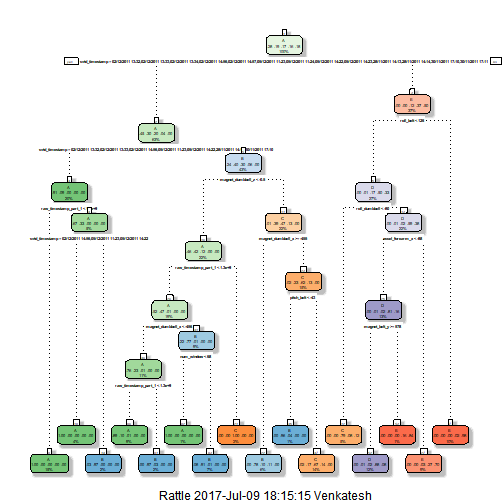

# About

Using devices such as Jawbone Up, Nike FuelBand, and Fitbit it is now possible to collect a large amount of data about personal activity relatively inexpensively.
These type of devices are part of the quantified self movement - a group of enthusiasts who take measurements about themselves regularly to improve their health, to find patterns in their behavior, or because they are tech geeks. One thing that people regularly do is quantify how much of a particular activity they do, but they rarely quantify how well they do it. In this project, oour goal will be to use data from accelerometers on the belt, forearm, arm, and dumbell of 6 participants.

# Data

The training data for this project are available here:

https://d396qusza40orc.cloudfront.net/predmachlearn/pml-training.csv

The test data are available here:

https://d396qusza40orc.cloudfront.net/predmachlearn/pml-testing.csv

# Analysis

## Appraoch

* Load the data set and briefly learn the characteristics of the data
* Use cross-validation method to built a valid model; 60% of the original data is used for model building (training data) while the rest of 40% of the data is used for testing (testing data)
* CLean the data by considering quality data.  
* Apply PCA to reduce the number of variables
* Apply random forest method to build a model
* Check the model with the testing data set - Cross validation
* Apply the model to estimate classes of 20 observations

An overall pseudo-random number generator seed was set at 5 for all code


## Library & Seed


```r
library(knitr)
library(caret)
library(randomForest)
library(rpart)
library(RColorBrewer)
library(rattle)
library(rpart.plot)
set.seed(5)
```

## Loading data


```r
trainUrl <- "http://d396qusza40orc.cloudfront.net/predmachlearn/pml-training.csv"
testUrl <- "http://d396qusza40orc.cloudfront.net/predmachlearn/pml-testing.csv"

training <- read.csv(url(trainUrl), na.strings=c("NA","#DIV/0!",""))
testing <- read.csv(url(testUrl), na.strings=c("NA","#DIV/0!",""))

dim(training)
```

```
## [1] 19622   160
```

```r
dim(testing)
```

```
## [1]  20 160
```

## Partioning the Training data set in to Train & test

We will split the training data in to 60 - 40 ratio , so that we can validate our model with the Training- Test data, before proceeding with test data.


```r
inTrain <- createDataPartition(y=training$classe, p=0.6, list=FALSE)
myTraining <- training[inTrain, ]
myTesting <- training[-inTrain, ]
dim(myTraining)
```

```
## [1] 11776   160
```

```r
dim(myTesting)
```

```
## [1] 7846  160
```

## Data Manupulation

Now we will remove the columns where NA % is greater than 60. This is because so many NA values in column will not produce fruitful results while using for prediction.


```r
myTraining <- myTraining[c(-1)]

x <- apply(myTraining ,2, function(y) sum(is.na(y))) / nrow(myTraining)
myTraining <- myTraining[!(x > 0.6)]
```

Make the test & training data to be in same format.


```r
Header1 = colnames(myTraining)
Header2 = colnames(myTraining[1,-59])
myTesting <- myTesting[Header1]

testing <- testing[c(-1)]
testing <- testing[Header2]


testing <- rbind(myTesting[1,1:58],testing)
testing <- testing[-1,]
```

## PCA

We have 50+ columns which will be cumbersome sometimes to do analysis. Hence we will use PCA technique to get the uncorrelated columns for predicting variables in the dataset.


```r
preProc <- preProcess(myTraining[,1:59],method="pca",thresh=.8) 
# PCA needed 15 components to capture 80 percent of the variance

preProc <- preProcess(myTraining[,1:59],method="pca",thresh=.95) 
#PCA needed 28 components to capture 95 percent of the variance

preProc <- preProcess(myTraining[,1:59],method="pca",pcaComp=28)

myTrainingPCA <- predict(preProc,myTraining[,1:59])
```


## Trees


```r
modFitA1 <- rpart(myTrainingPCA$classe ~ ., data=myTraining, method="class")

fancyRpartPlot(modFitA1)
```



Now we will compare the out of sample error using cross validation method.

## Predictions with Testing data set.- Cross Validation


```r
predictionsA1 <- predict(modFitA1, myTesting, type = "class")

confusionMatrix(predictionsA1, myTesting$classe)
```

```
## Confusion Matrix and Statistics
## 
##           Reference
## Prediction    A    B    C    D    E
##          A 2148   59   11    3    0
##          B   63 1242   85   68    0
##          C   21  208 1244  193   49
##          D    0    9   18  818   81
##          E    0    0   10  204 1312
## 
## Overall Statistics
##                                           
##                Accuracy : 0.8621          
##                  95% CI : (0.8543, 0.8697)
##     No Information Rate : 0.2845          
##     P-Value [Acc > NIR] : < 2.2e-16       
##                                           
##                   Kappa : 0.8255          
##  Mcnemar's Test P-Value : NA              
## 
## Statistics by Class:
## 
##                      Class: A Class: B Class: C Class: D Class: E
## Sensitivity            0.9624   0.8182   0.9094   0.6361   0.9098
## Specificity            0.9870   0.9659   0.9273   0.9835   0.9666
## Pos Pred Value         0.9671   0.8519   0.7254   0.8834   0.8598
## Neg Pred Value         0.9851   0.9568   0.9798   0.9324   0.9794
## Prevalence             0.2845   0.1935   0.1744   0.1639   0.1838
## Detection Rate         0.2738   0.1583   0.1586   0.1043   0.1672
## Detection Prevalence   0.2831   0.1858   0.2186   0.1180   0.1945
## Balanced Accuracy      0.9747   0.8920   0.9183   0.8098   0.9382
```


## Random Forests


```r
modFitB1 <- randomForest(myTrainingPCA$classe ~. , data=myTraining)

predictionsB1 <- predict(modFitB1, myTesting, type = "class")

confusionMatrix(predictionsB1, myTesting$classe)
```

```
## Confusion Matrix and Statistics
## 
##           Reference
## Prediction    A    B    C    D    E
##          A 2232    1    0    0    0
##          B    0 1517    6    0    0
##          C    0    0 1362    4    0
##          D    0    0    0 1282    7
##          E    0    0    0    0 1435
## 
## Overall Statistics
##                                           
##                Accuracy : 0.9977          
##                  95% CI : (0.9964, 0.9986)
##     No Information Rate : 0.2845          
##     P-Value [Acc > NIR] : < 2.2e-16       
##                                           
##                   Kappa : 0.9971          
##  Mcnemar's Test P-Value : NA              
## 
## Statistics by Class:
## 
##                      Class: A Class: B Class: C Class: D Class: E
## Sensitivity            1.0000   0.9993   0.9956   0.9969   0.9951
## Specificity            0.9998   0.9991   0.9994   0.9989   1.0000
## Pos Pred Value         0.9996   0.9961   0.9971   0.9946   1.0000
## Neg Pred Value         1.0000   0.9998   0.9991   0.9994   0.9989
## Prevalence             0.2845   0.1935   0.1744   0.1639   0.1838
## Detection Rate         0.2845   0.1933   0.1736   0.1634   0.1829
## Detection Prevalence   0.2846   0.1941   0.1741   0.1643   0.1829
## Balanced Accuracy      0.9999   0.9992   0.9975   0.9979   0.9976
```

```r
## The accuracy of this model is  0.9977 . Hence the Sample out error is 0.23 % 
```

This model appears to be more robust than previous model. Hence we will proceed with this model to clacluate classe for training data set given.


```r
predictionsB2 <- predict(modFitB1, testing, type = "class")
```

## END

